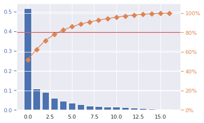

## 1. EDA

---

### Basic analysis

- **target feature** :

  - WHO source : "life_expect" and why not "life_expect60", outlier (min value) = 2010 Haiti earthquake
  - UNICEF source : "une_life", outlier (min value) = Sierra Leone war (1991 – 18 janv. 2002)
  - une_life looks more stable (less outliers), but then maybe less truthful ?

- **nb columns/rows** : 32 columns / 3111 rows

- **columns types** : 28 floats, 3 objects/category-like, 1 int ('year' col => may need casting).
  Float types cols are mainly rates per n-pop or percentages.

- **missing values** :
  - "hospitals" has 95% missing data => non usable.
  - top missing values : hospitals (95%), pop education indicator cols from Unicef (school: 74%, edu_spend: 41%, literacy: 81%, poverty: 70%)
  - perfect correlation between vaccinations data (measles, polio and diphtheria). When 1 of those is missing, so are the others.
  - vacc data tends to miss when "basic_water" is missing (0.8 corr).
  - when "alcohol" value is missing, some pop health values too : vacc data (0.6), pop body shape (0.7)

Some correlation between mising values can indicate a variable correlation.  
I decided that cols with >80% missing values won't be considered.

### Indicators

I believe that each column can be categorized in indicators :

- **Mortality** : adult_mortality, infant_mort, age1-4mort
- **Government** : gghe-d, che_gdp, une_edu_spent
- **Population Health** :
  - health coverage : vaccinations, hospitals, doctors
  - sanitary : basic_water, alcohol
  - physical shape : bmi, age5-19thinness, age5-19obesity
- **Standard of living**: une_poverty, gni_capita, une_gni
- **Education** : une_school

That doesn't necessarily mean that we should explicitly do a classification work on the dataset.
But for the analysis, we could identify and group variables to visualize their relation with the target.

### In-depth analysis

- **target visualisation**:
  - an outlier for Haiti (2010 seism)
- **variable signification**:
- **correlations variables/target**:

  1. mortality : strongly correlated with target.
  2. pop health :
     - health coverage : small corr with polio/diphteria/measle
     - sanitary : strong correlation with basic_water
  3. government :
  4. living standard : poverty
  5. education :

### First conclusions

### Advanced analysis

- **Analysis per region**
  - target :
    - Africa has the lowest life_exp => verified by high mortality rates while
    - Europe has the highest one => close to Americas, Eastern Mediteranea and South Asia
  - mortality :
    - Africa has the highest general mortality
  - pop health :
  - living standard :
  - education :

Profiling regions can help us to identify what indicators raise or lower life_expect

- **correlations between indicators**:

  1. mortality / mortality : adult mortality is strongly correlated to infant mortality.
  2. mortality / pop health :
     - health coverage :
     - physical shape :
     - sanitary :
  3. mortality / government :
  4. mortality / standard of living :
  5. pop health / pop health :
  6. pop health / government :
  7. pop health / standard of living :

- **categorize differents life exp.**:
  I used "une_life" because it is more stable with less outliers (better for future dim reduction, model training, ...).
  - Hepatitis vacc seems to have less impact on life_exp than other vacc, plus we don't know its type and repartition (A, B, C or D) => eliminate hepatitis ?
  - HIV
  - Pop with high life exp tends to drink more alcohol than the others => eliminate alcohol var ?
  - Education variables seem to separate pretty well all the different life exp cat => watch for feature selection

## 2. Hypothesis / Intuitions / Ideas
---

- **Hypothesis 1** : "Their is a relation between life exp and regions. Same for countries". h0 => **rejected**.
- **Hypothesis 2** : "Poor countries population tend to live less long, and vice versa rich population tends to live longer".
- **Hypothesis 3** : "An educated population significatively tends to live longer". h0 => **rejected**

- **Hypothesis 4** : "Pop health has a significative impact on life exp".
  - **4.1** : sanitary (basic_water) => **h0 rejected**
  - **4.2** : physical shape => **h0 rejected** BUT bmi and obesity may give false assumptions from what we saw before.
  - **4.3** : health coverage (measles, polio, diphtheria)
  - **4.4** : governments investments

## 3. Pre-processing
---

## Pre-selection

- **Missing values :** All variables having a missing rate over or equal to **80%** are automatically eliminated.

- **EDA :** From what we saw in the EDA, some variables had almost no impact on the target or could mislead on interpretation (ex: alcohol being prevalent in regions/countries where life exp is high).

- **Singificant cols :** basic_water col, mortality and standard of living indicators seem really significant with respect to the target.

- **Columns kept:** region, country, adult_mortality, infant_mort, age1-4mort, une_poverty, une_gni, gni_capita, une_school, une_edu_spend, basic_water, bmi, age5-19thinness, age5-19obesity, measles, polio, diphtheria, gghe-d, che_gdp

## Feature engineering

### Categorize life expectancy

The main goal is to create a categorical feature from the target, thus shifting the problem into classification instead of regression.

- most likely to be interpreted : predictions would be in a category instead of being numbers.

- test some models with or without it as the target and compare results

## Encoding

### Categorical columns

These correspond to regions and countries (not country code).
I decided to apply a One-Hot encoding with a resulting sparse matrix (takes less memory).

### Target

I decided to use a simple label encoding, well-suited to target encoding. Another reason is because there is only 5 categories for the classificiation.

## Scaling

Numerical columns are subject to scaling, to make it easier for computations and future dim reductions. I used a standard scaling because it is less sensitive to outliers compared to min-max.

## Dimensionality reduction (PCA)

I did a PCA to check if it was possible to represent the dataset with less dimensions, without loosing too much informations (~80% of explained variance). Turns out we can get by with 5 dimensions.

## 4. Feature selection

## 5. Model selection

## Final thoughts

- This dataset doesn't provide any data about political conflicts or wars => can affect gradually a country/region life expectancy
- The ML model is very sensible to noise => deadly natural disasters(ex : 2010 Haiti seism outlier)
- Too few occurences for each country => harder to profile life exp => harder to train models
  - some (encoded) countries may not be in trainset when doing a train/test split
  - number of k-fold shouldn't exceed the number of occurences per country => risk to not have every country per fold.
- More data for some regions could help to improve the model performance
